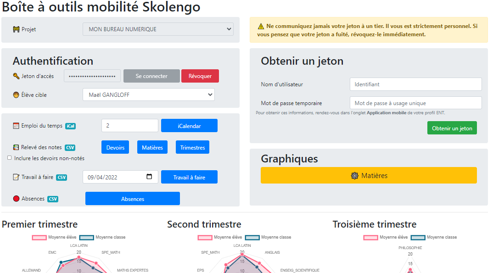

# kdecole-toolbox
<p align="center">
  
</p>
Boîte à outils pour télécharger l'ensemble des notes, absences, travaux à faire d'un élève au format CSV et l'emploi du temps au format iCalendar.  
🚨 Attention : ce projet utilise l'ancienne version de l'API Skolengo (module [kdecole-api](https://github.com/maelgangloff/kdecole-api)). Il est possible qu'elle devienne obsolète dans l'éventualité où l'accès à l'ancienne API serait définitivement clos.

## Exemple


## Mise en marche

1. Installer Node.js
2. Cloner le dépôt
```shell
git clone https://github.com/maelgangloff/kdecole-toolbox
```
3. Télécharger les dépendances
```shell
npm install --no-dev
```
4. Démarrer le serveur
```shell
node index.js
```
5. Se rendre à l'adresse http://localhost:8080/ depuis un navigateur
